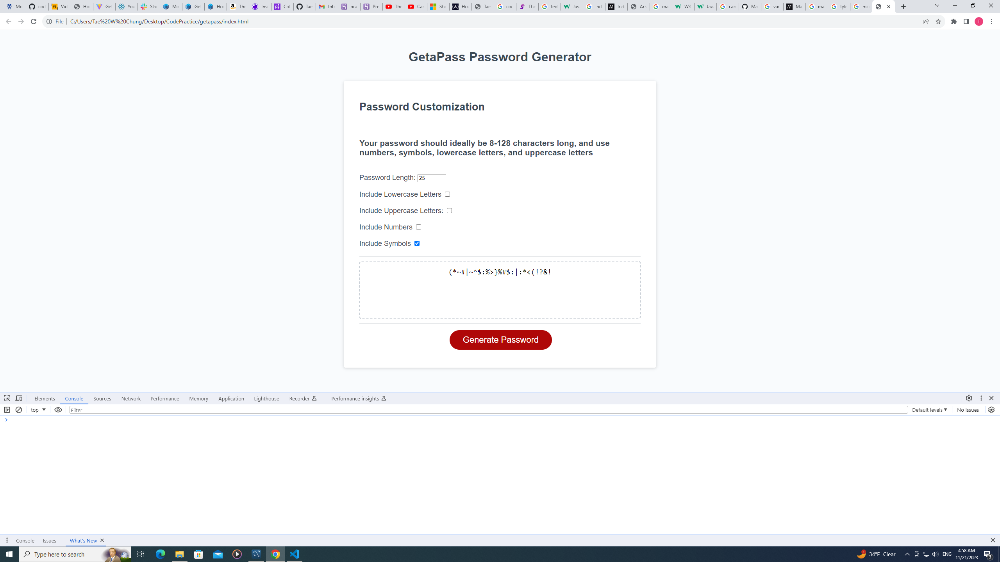
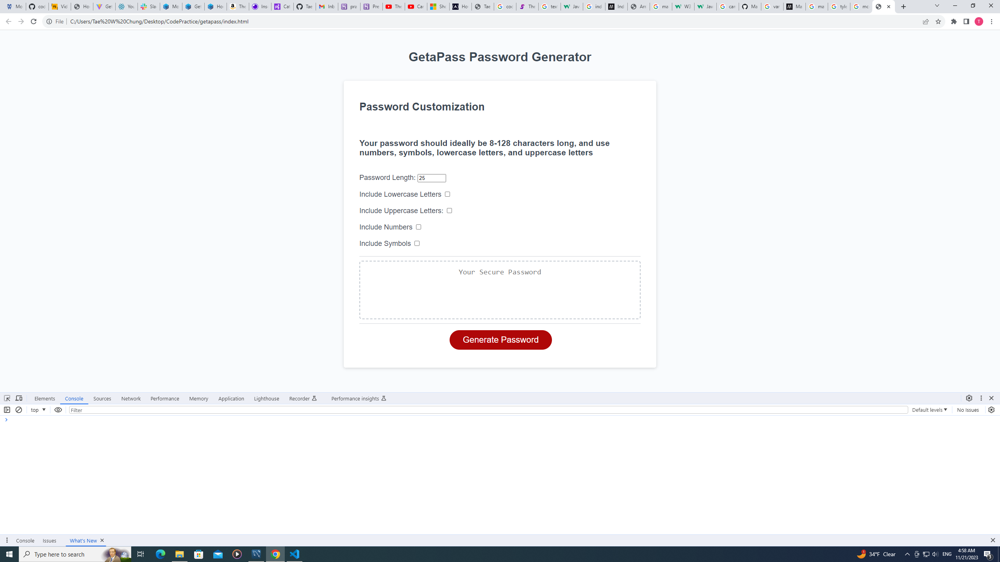
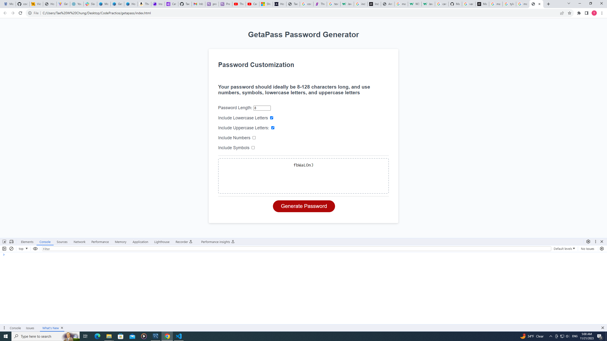
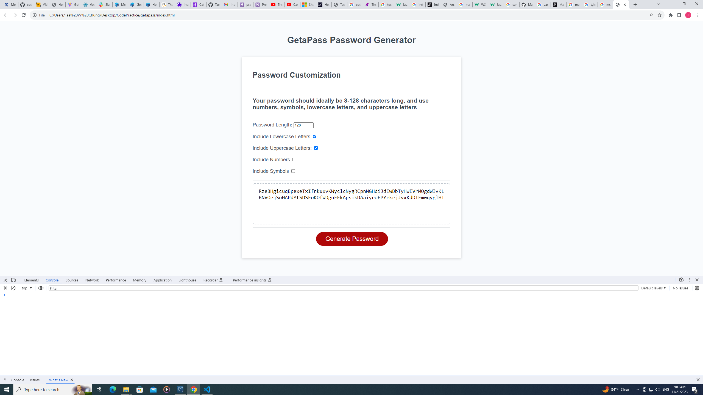

# GetaPass

    GetAPass is a password generator for all your security needs. Choose from a plethora of character types,
    ensuring all your generated passwords are strong and extremely difficult to guess.

# Credits

    This uses JavaScript, HTML, and CSS.
    Starter code from Columbia Bootcampspot code.
    AskBCS Learning Assistant.

# Showcase

